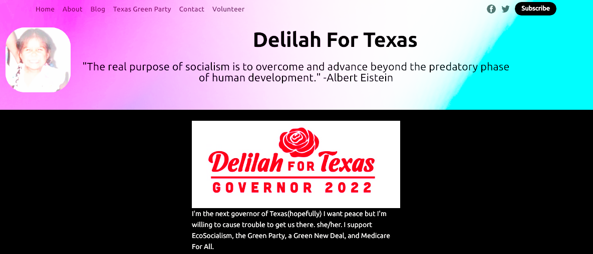

# Uncensored News
This Ghost theme is perfect for politicians and progessive organizations.   The politician's image (or Organizational Logo) is floated left. The title and biline are user editable.



The world has a problem, that the Mainstream Media throttles access to progressive news.  It is not clear
censorship like Tienamen Square in China, the progressive news is just throttled, the
algorithms do not show that information frequently  You can help circumvent this media throttling by
using the Uncensored News theme on your blog.  There will be a regular stream of fresh news articles,
giving your readers a good reason to return, and sign up for your email newsletter.  From which I hope you make
some money in order to support your progressive organization or favorite candidate. 

So to install this theme, you need to do two things.  Upload both the theme zip file.  At your Ghost web site navigate to /ghost/settings/theme and upload the zip file.

And at /ghost/settings/labs upload the routes.yaml file. 

# First time using a Ghost theme?

Ghost uses a simple templating language called [Handlebars](http://handlebarsjs.com/) for its themes.

This theme has lots of code comments to help explain what's going on just by reading the code. Once you feel comfortable with how everything works, we also have full [theme API documentation](https://ghost.org/docs/themes/) which explains every possible Handlebars helper and template.

**The main files are:**

- `default.hbs` - The parent template file, which includes your global header/footer
- `index.hbs` - The main template to generate a list of posts, usually the home page
- `post.hbs` - The template used to render individual posts
- `page.hbs` - Used for individual pages
- `tag.hbs` - Used for tag archives, eg. "all posts tagged with `news`"
- `author.hbs` - Used for author archives, eg. "all posts written by Jamie"
- `partials/header.hbs` - Used for the header of the pages.  Includes photo, title and description."

One neat trick is that you can also create custom one-off templates by adding the slug of a page to a template file. For example:

- `page-about.hbs` - Custom template for an `/about/` page
- `tag-news.hbs` - Custom template for `/tag/news/` archive
- `author-ali.hbs` - Custom template for `/author/ali/` archive


# Development

Casper styles are compiled using Gulp/PostCSS to polyfill future CSS spec. You'll need [Node](https://nodejs.org/), [Yarn](https://yarnpkg.com/) and [Gulp](https://gulpjs.com) installed globally. After that, from the theme's root directory:

```bash
# install dependencies
yarn install

# run development server
yarn dev
```

Now you can edit `/assets/css/` files, which will be compiled to `/assets/built/` automatically.

The `zip` Gulp task packages the theme files into `dist/<theme-name>.zip`, which you can then upload to your site.

```bash
# create .zip file
yarn zip
```

# PostCSS Features Used

- Autoprefixer - Don't worry about writing browser prefixes of any kind, it's all done automatically with support for the latest 2 major versions of every browser.
- [Color Mod](https://github.com/jonathantneal/postcss-color-mod-function)


# SVG Icons

Casper uses inline SVG icons, included via Handlebars partials. You can find all icons inside `/partials/icons`. To use an icon just include the name of the relevant file, eg. To include the SVG icon in `/partials/icons/rss.hbs` - use `{{> "icons/rss"}}`.

You can add your own SVG icons in the same manner.


# Copyright & License

Copyright (c) 2013-2021 Ghost Foundation - Released under the [MIT license](LICENSE).
